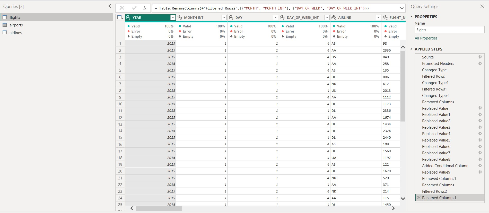
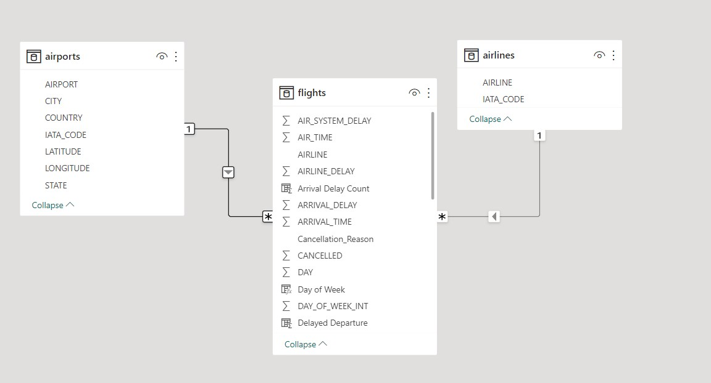
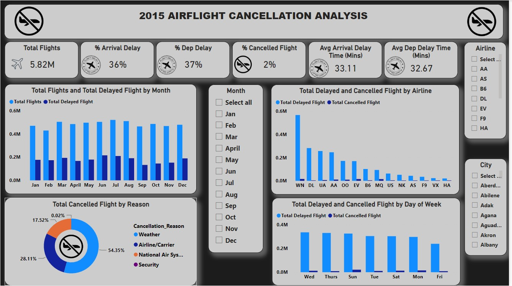

# Airline-Cancellation

## Introduction
This is an analysis of **Airline cancellations** for 2015. The data source was a simple csv file which was Imported to Power BI for this analysis. There were 3 tables used, Flights table, Airlines table & Airports table. A 4th table was created called DAX table to keep all measures calculated.

## Problem Statement
The aim of this analysis is to answer the following Business related questions:
- How does the overall flight volume vary by month? By day of week?
- What percentage of flights experienced a departure delay in 2015? 
- Among those flights, what was the average delay time, in minutes?
- How does the % of delayed flights vary throughout the year?
- How many flights were canceled in 2015? 
- What % of cancellations were due to weather? 
- What % were due to the Airline/Carrier?
- Which airlines seem to be most and least reliable, in terms of on-time departure?

## Skills & Concept Used:
- Data Modelling
- Creating Calculated Columns using DAX(IF else statements)
- Developing Measures using different functions
- Use of filters
- Data Visualization & Design (Using appropriate visuals to send appropriate message to stakeholders)

## Data Transformation/Cleaning/Manipulation:
- Transformation took place using power query. Column quality/distribution was checked for nulls, values were replaced. In addition, Day of the week & month columns were   created along side conditional columns using (If/else statements)
- Lots of data cleaning was done as there were so many unwanted rows and columns, hence they were removed for this analysis. This helps to enhance performance &   efficiency of Power BI as too much irrelevant data will slow the performance.

## Data Modelling:
By default, Power BI automatically connects different tables using its intelligence; however, this connection doesn't always yield what you want. Hence it is best practice to do the connection yourself and use the star schema approach. This concept involves using the primary & foreign key concept (1 to many relationship concepts). I have a fact table (Flights) and 2 dimension table (Airline & Airport table). Both were connected using 1 to Many relationship. Without this connection, you won’t be able to interact correctly with your visuals. 

## Data Visualization:

The page name is Airflight cancellation. The visuals used consisted of cards, clustered column chart, pie chart and different slicers. The slicers used are to make the dashboard an interactive one so as to answer different business problems based on the data presented.

## Insights:
- A total of 5.82M flights were recorded for 2015 and among them were 2% cancellation, 36% arrival delays and 37% departure delays. Overall the flights vary monthly by  approximately 52,000 & day of the week by about 1800 flights.
- Overall % delayed departure was 37% & overall avg delay in mins was 32.67mins 
- Overall the % delay departure varied by an average of 4.5% 
- Flights canceled were @ 2%. 54.35% was from bad weather & 28.11% was from Airline/Carrier.
- Airline AS is the most reliable at 25% and Airline B6 & F9 both at 38%.

